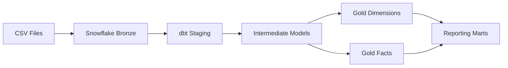

# Snowflake DBT Retail Analytics Platform

An end-to-end analytics engineering project built using Snowflake and dbt.

This project demonstrates the design and implementation of a modern data warehouse using the Medallion Architecture approach:

- Bronze Layer: Raw data ingestion into Snowflake
- Silver Layer: Data cleaning, transformation and business logic using dbt
- Gold Layer: Analytics-ready dimensional models and fact tables


## Architecture


## Repository Structure


Snowflake-DBT-Retail-Analytics/

│

├── data/

├── sql/

├── retail_project/

│ ├── models/

│ ├── seeds/

│ ├── snapshots/

│ ├── tests/

│ └── macros/

├── README.md

└── packages.yml

# Technology Stack

| Component            | Technology|
|----------------------|-----------|
| Cloud Data Warehouse | Snowflake |
| Transformation       | dbt Core  |
| Programming          | SQL       |     
| Data Quality         | dbt Tests |
| Package Management   | dbt-utils |
| Version Control      | GitHub    |


# Medallion Layers

Instead of listing models randomly:

```markdown
## Bronze Layer

- Raw CSV ingestion
- External Stage
- Internal Stage
- File Format
- Raw Tables

---

## Silver Layer

### Staging

- stg_customers
- stg_orders
- stg_products
- stg_sellers
- stg_order_items
- stg_order_payments

### Intermediate

- int_order_details

---

## Gold Layer

### Dimensions

- dim_customers
- dim_products
- dim_sellers
- dim_date

### Facts

- fact_orders (Incremental)
- fact_sales

### Reporting

- sales_summary
- customer_360
- product_performance
- seller_performance

# Data Quality Decisions

## Handling Missing Product and Seller Information

The intermediate order model preserves all orders using LEFT JOIN operations.

Some orders in the source system do not have corresponding order item records.

Mainly:

- CANCELED orders
- UNAVAILABLE orders


For these records:

- PRODUCT_ID can be NULL
- SELLER_ID can be NULL


These records are intentionally retained to maintain source completeness.

Business filtering rules will be applied in downstream Gold layer models based on analytical requirements.


# Data Modeling Approach

The intermediate model follows:

**Grain: One record per Order Item**

The model combines:

- Orders
- Customers
- Products
- Sellers
- Payments


Payment information is aggregated before joining to prevent duplicate records caused by one-to-many relationships.


# Future Enhancements

Planned improvements:

- Gold star schema implementation
- Incremental loading strategy using dbt incremental models
- Slowly Changing Dimensions (SCD Type 2)
- Automated testing pipeline
- GitHub Actions CI/CD integration
- dbt documentation deployment
- Snowflake performance optimization


# How to Run the Project

## Prerequisites

Before running the project, ensure:

- Python environment is configured
- dbt Core is installed
- Snowflake connection profile is configured
- Required dbt packages are installed


## Install dbt Packages

- Install dependencies defined in `packages.yml`:
- dbt deps

- Verify dbt can connect successfully to Snowflake :
- dbt debug

- Execute all dbt transformations (Run dbt Models):
- dbt run

- Execute dbt data validation tests :
- dbt test